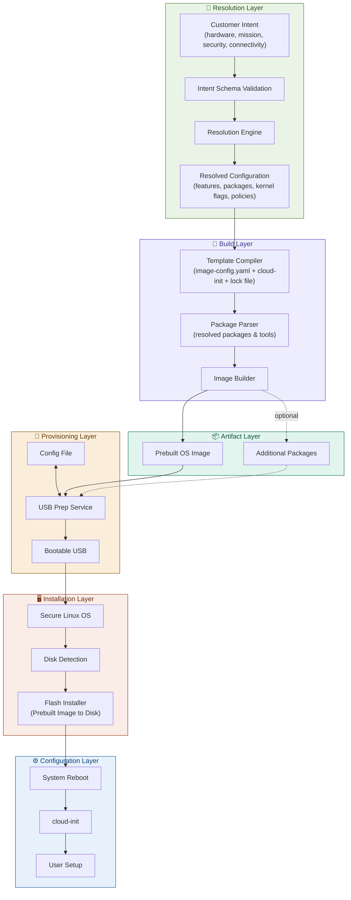

<!-- SPDX-FileCopyrightText: (C) 2026 Intel Corporation -->
<!-- SPDX-License-Identifier: LicenseRef-Intel -->
# Design Proposal: Edge Node Infrastructure BluePrint

Author(s): Edge Infrastructure Team

Last updated: 13/04/2026

## Abstract

This ADR outlines the strategy for developing a pre-configured, offline-capable Ubuntu-based edge node image designed to demonstrate Intel® AI capabilities on edge devices. The solution targets compact rugged devices running on Intel® Core/Core Ultra/Xeon platforms and delivers a ready-to-flash, USB-bootable image that encapsulates the OS, drivers, container runtime, K8S stack, and system configurations derived from a user-provided template.

The image bundles Ubuntu 24.04 (Non-RT kernel; 26.04 when enabled), Intel-provided drivers and user-space packages exposing CPU, iGPU, NPU, SR-IOV, and Intel® vPro capabilities to the application layer. It supports containerized workloads, K8S extensions, iGPU/NPU accelerated containers, and P/E core allocation.

The output is a USB-bootable, air-gapped installer enabling consistent, repeatable deployments with no internet dependency. On first boot, the system is immediately operational for Intel AI workloads — object detection, annotated video feeds, text-to-speech(TTS), large language model(LLM) + speech-to-text(STT) interaction, and object query retrieval.

## Blueprint Ingredients

### 1. Operating System

| Attribute | Detail |
|-----------|--------|
| Base OS | Ubuntu 24.04 LTS (Non-RT Kernel) |
| Upgrade path | Ubuntu 26.04 when enabled as part of BKC |
| Image type | TBD — Desktop or Server image; Boot OS (Alpine or Intel Bootkit) |

> **Open item:** Confirm Desktop vs. Server image type and Boot OS selection (Alpine or Intel Bootkit).

---

### 2. Drivers

Intel-provided drivers and user-space packages exposing platform capabilities to the application layer:

| Domain | Component | Notes |
|--------|-----------|-------|
| **Compute** | Intel Core, Core Ultra, Xeon processor drivers | CPU frequency, power management |
| **Graphics — iGPU** | Intel Integrated GPU drivers | OpenCL / Level Zero, media driver (`intel-media-va-driver`) |
| **Graphics — dGPU** | Intel Discrete GPU drivers | Where applicable |
| **AI Acceleration** | Intel NPU driver + firmware | Neural Processing Unit; `/dev/accel/accel0` |
| **Manageability** | Intel vPro platform technology | AMT |
| **Virtualization** | SR-IOV + GFX drivers | iGPU acceleration to workloads through Virtual Functions |

> **Open item:** List all drivers and corresponding versions, linking to GitHub references or JIRA tickets for each.

---

### 3. Containerized Workloads

| Component | Detail |
|-----------|--------|
| Container runtime | Docker, containerd, runc |
| Package manager | Helm |
| K8S distribution | K3s (lightweight Kubernetes) |
| Accelerated containers | iGPU/NPU accelerated containers via Intel GPU device plugin |
| Core allocation | P/E core allocation via kernel boot parameters (`isolcpus`, `cpuset`) |
| K3s images | Pre-downloaded during USB creation via tools/scripts |
| Cluster bootstrap | Installer script triggering K8S cluster creation at cloud-init |

> **Open item:** Decide on Script vs. ICT approach based on: long-term support, image size optimization, ease of pre-installing required APT packages and user-space applications.

---

### 4. Installation & Validation Flow

```
1. Create OS image using ICT
2. Create bootable USB image
3. Provision the edge node through USB
4. Verify Docker container or K8S deployment modes
5. Verify automated application deployments (SceneScape, PDD, etc.)
6. KPI measurements
```

**KPI Targets:**

| KPI | Metric |
|-----|--------|
| USB creation time | TBD |
| Provisioning time | TBD |
| OS boot time (to user space) | TBD |
| Application deployment time | TBD |
| CPU allocation efficiency | TBD |
| CPU load under workload | TBD |

---

### 5. KPIs — System-Level Tests

System-level tests measuring compute, memory, storage, power, network, and platform throughput across the full hardware stack (CPU, iGPU, NPU, memory bandwidth, NVMe, NIC).

## Proposal

Two options are available to generate the pre-built USB-bootable image:

**Option 1: Script-Based Image Generation** — Automation scripts download a minimal Ubuntu base image from Canonical, install required packages and configurations, pre-download K3s images, and convert to a desktop environment if needed.

**Option 2: ICT (Image Composer Tool)** — ICT generates the custom Ubuntu image and applies the required configuration from the user template. Preferred for long-term support, image size optimization, and ease of pre-installing required APT packages and user-space applications.

> **Decision required:** Alignment on long-term support implications of Script vs. ICT before committing to either path.

### Solution Approach: Intent-to-Template Compiler Model

The solution emphasizes on a **layered compiler model** that abstracts customer intent (high-level features and policies) from low-level infrastructure configuration. This design decouples customer-facing intents from implementation details, enabling extensibility and configurability while enforcing SWaP-C constraints and reproducibility.

#### Core Layer Model

The image builder comprises **five functional layers**:

**1. Intent Layer** — Customer-facing abstraction exposing only essential toggles. Intent can be expressed in multiple forms, including **natural language prompts** meant to be processed by an AI agent
- **Hardware profile**: Atom/Core/Core Ultra/Xeon; iGPU, NPU, vPro presence; SR-IOV support
- **Mission profile**: AI inference, real-time workloads, edge management, secure enclave
- **Security posture**: Baseline, hardened, locked-down (implies SecureBoot, measured boot, immutability, FDE)
- **Deployment mode**: Container, K3s, VM
- **Connectivity**: Connected (periodic updates) or air-gapped (complete offline build)
- **SWaP-C mode**: Minimal (smallest image, idle power), balanced, performance-optimized

**2. Configuration File** — User-defined YAML controlling:
- Deployment type (Container-based, K3s, or VM-based)
- User credentials and access policies
- Network/proxy settings
- Driver selection flags (`enable_igpu`, `enable_npu`, `enable_sriov`, `enable_vpro`)
- Optional package and tool selection (`enable_monitoring`, K3s image pre-fetch)

This file is generated from the intent layer via the **Resolution Engine** (see architecture below).

**3. OS Image Generation** — `image-generator.sh` (Script path) or ICT (ICT path) consumes the resolved configuration, fetches the Ubuntu 24.04 ISO, runs BKC scripts, installs Intel drivers and tools, pre-downloads K3s images, and produces the bootable image.

**4. Bootable USB Creation** — `bootable-usb-prepare.sh` converts the generated OS image into a live USB installer ready for air-gapped deployment.

**5. Cloud-Init Configuration** — Handles first-boot initialization, K8S cluster bootstrap, post-install customization, and application bring-up.

> **Layer Decoupling Principle**: Layers are intentionally loosely coupled. The resolver output is a portable configuration that any compatible build backend can consume. Skills defined at any layer (e.g., ICT skills at the Build Layer) can be invoked independently or reused from other layers without traversing the full pipeline. A deployment team can, for example, call ICT skills directly against a pre-authored config without going through the Intent or Resolution stages.

#### Internal Layers: Resolution Engine & Template Compiler

Between the Intent API and the four-block pipeline stands a **two-stage compiler**:

**Resolution Engine:**
- Transforms high-level intent into a concrete low-level configuration file
- Implements rule-based feature expansion: each feature (e.g., security=hardened) triggers implications (e.g., SecureBoot→enabled, measured boot→enabled, immutability→enabled, FDE→enabled)
- Validates feature compatibility using:
  - **Feature Catalog**: Each feature defines prerequisites, conflicts, dependencies, and SWaP-C cost
  - **Capability Matrix**: Hardware/OS support matrix for CPU, iGPU, NPU, vPro, SR-IOV per platform
  - **Policy Packs**: Frozen, versioned baselines for security, performance, and accreditation
- Fails early with guided remediation if conflicts or unsupported combinations are detected

**Template Compiler:**
- Generates deterministic outputs from resolved configuration:
  - Image Composer template (ICT-ready YAML)
  - Cloud-init payload for first-boot setup
  - Build manifest lock file (exact package versions, kernel version, hashes)
  - Human-readable bill of materials, rationale, and SWaP-C impact report
- Profile overlays: global defaults → hardware profile → mission profile → security/perf overlays → user overrides
- All outputs are structured, validated, and reproducible (same intent + lock file → identical artifact hash)

#### Offline & Air-Gapped Support

When connectivity mode = air-gapped:
- Resolver validates all referenced packages and repositories are available offline
- Compiler includes signed metadata, checksums, and mirror URLs
- Build orchestrator bundles package repos and all artifacts into a single offline artifact
- No dependency on public internet during target provisioning or first boot

#### SWaP-C Governance

Before build, a verification stage scores the configuration:
- **Size budget**: Artifact MB delta per feature; cumulative cap enforced
- **Idle power**: List of disabled services; idle daemon overhead estimated
- **Mission power**: Workload power profiles based on hardware and kernel settings
- **Security conformance**: Policy violation checks (e.g., SecureBoot required if mission includes encryption)
- **Reproducibility**: Validates lock file determinism

If a feature set violates budgets, build fails with recommended alternatives (prune services, disable features, etc.).

## Rationale

### Field Deployment Constraints (SWaP-C Priority)

Handheld, rugged edge devices operate under strict SWaP-C constraints:
- **Size/Weight**: Limited onboard storage (NVMe 256GB–1TB typical); every MB earned
- **Power**: Battery-backed operation; idle power draw is mission-critical
- **Cost**: Minimal labor for setup; zero dependency on field IT infrastructure or connectivity

A USB-bootable, air-gapped model addresses these by packaging the full software stack — OS, Intel drivers (iGPU, NPU, SR-IOV, vPro), AI runtime, container tools, K3s, and security policies — into one self-contained, pre-validated artifact built once, deployed many times.

### Abstraction Layer Rationale

Customers (mission operators) care about stating intent ("I need AI inference with hardened security"), not configuring kernel cmdline, service masks, or package repositories. Conversely, development/infrastructure teams must maintain fine-grained control over package versions, driver compatibility, and accreditation states.

The Intent-to-Template Compiler model enforces a **clean contract boundary**:
- **Customers provide**: Hardware profile, mission profile, security posture, connectivity mode
- **Resolver ensures**: Feature implications, conflict detection, SWaP-C conformance, reproducibility
- **Compiler emits**: Low-level templates ready for ICT or script-based build

This enables:
- **Extensibility**: New features added by updating feature catalog and policy packs, not code
- **Configurability**: Customers control only essential high-level intent; infrastructure complexity is automated
- **Ease-of-use**: Presets (e.g., "AI Inference Handheld") encapsulate best practices; advanced users can refine intent
- **Governance**: Rule-based resolver enforces accreditation, security, and SWaP-C policies uniformly
- **Reproducibility**: Deterministic compiler + lock file ensures audit trails and supply-chain integrity

### Four-Block Foundation

The configuration-file-driven design separates user customizations from the build logic, enabling reproducible builds across targets. Offering both script-based and ICT options accommodates different toolchain preferences and long-term support requirements, while the four-block architecture enforces a clean separation between image generation, USB preparation, and post-install setup.

SR-IOV and GFX Virtual Function support is included to enable iGPU acceleration for containerized workloads without requiring full GPU passthrough, improving density and isolation in K8S deployments.

## Technical Architecture: Intent-to-Template Compiler

### Data Model & Component Interaction

```
Customer Intent (High-Level)
  ↓ — can be a natural language prompt; AI agents can materialize and expand it before schema validation
[Intent Schema] → {hardware_profile, mission_profile, security_posture, deployment_mode, connectivity, swapc_mode}
    ↓
[Resolution Engine]
    ├─ Feature Catalog (feature → implications, cost, conflicts)
    ├─ Capability Matrix (hardware × OS × driver support)
    └─ Policy Packs (security, performance, accreditation rules)
    ↓
[Resolved Configuration] → {packages, services, kernel settings, driver flags, FDE/SecureBoot/immutability toggles}
    ↓
[Template Compiler]
    ├─ Generates: image-config.yaml (ICT-ready)
    ├─ Generates: cloud-init payload
    ├─ Generates: build.lock.yaml (determinism)
    └─ Generates: swapc-report.json (cost & impact)
    ↓
[Four-Block Build Pipeline]
    ├─ OS Image Generation (ICT or script)
    ├─ Bootable USB Creation
    ├─ Cloud-Init Provisioning
    └─ Validation & Verification
    ↓
Deployment-Ready Artifact (USB + Metadata + Provenance)
```

### Core Components

| Component | Format | Purpose |
|-----------|--------|----------|
| `intent.schema.yaml` | JSON Schema | Customer-facing contract |
| `feature-catalog.yaml` | YAML tree | Feature definitions with costs, conflicts, implications |
| `capability-matrix.yaml` | YAML matrix | Hardware/OS support matrix |
| `policy/security/*.yaml` | YAML rules | Security baselines (baseline, hardened, locked-down) |
| `policy/performance/*.yaml` | YAML rules | Performance profiles (interactive, batch, real-time) |
| `overlays/*.yaml` | YAML overlays | Mission-specific, hardware-specific stacks |
| `image-config.yaml` | YAML (output) | Resolved template for ICT/script consumption |
| `cloud-init/*.yaml` | YAML (output) | First-boot user-data, meta-data, vendor-data |
| `build.lock.yaml` | YAML (output) | Exact package versions, hashes, reproducibility info |
| `swapc-report.json` | JSON (output) | Cost summary, budget violations, recommendations |

### Extensibility Points

1. **Feature Plugins**: New features added to feature catalog without touching resolver core
2. **Policy Pack Versioning**: Frozen baselines for accreditation; new versions tracked in CI/CD
3. **Hardware Adapters**: New platforms added to capability matrix and driver overlays
4. **Backend Abstraction**: Switch from `image-generator.sh` to ICT or future tools by swapping build orchestrator
5. **Custom Overlays**: Mission-specific or customer-specific configuration stacks

### User Experience: Intent Entry Channels

All paths produce identical structured intent documents that resolve deterministically. The entry point is flexible — a user can start with a plain-language description and let agents do the expansion, or provide intent directly in structured form:

1. **Natural Language Prompt**: Intent expressed as free-form text or a conversational request. AI agents parse the prompt and materialize it — inferring hardware profile, mission profile, security posture, and connectivity mode from context
2. **Preset Profiles**: "AI Inference Handheld", "Secure Edge Gateway", "Real-Time Sensor"
3. **Guided CLI Wizard**: Conversational prompts for hardware, mission, security, connectivity
4. **CI-Driven**: Programmatic intent submission for automated pipelines and validation

## Implementation Plan: Phased Approach

### Phase 1: Config-File-Driven Foundation (Direct Path)
**Duration**: TBD
**Scope**: Direct YAML configuration without intent layer; basic four-block pipeline with common deployment scenarios
**Outputs**: Functional config-to-image pipeline; USB bootable artifact generation; air-gapped build capability; basic validation

**Rationale**: Phase 1 bypasses the resolution engine and template compiler infrastructure, instead accepting pre-authored `image-config.yaml` directly. This establishes the core building blocks (OS generation, USB prep, cloud-init, validation).

#### Phase 1 Deliverables
1. **Configuration Schema** — Finalize `image-config.yaml` YAML structure (OS version, deployment type, credentials, network/proxy, driver flags, kernel settings, package list).
2. **OS Image Generation** — `image-generator.sh` (or ICT): fetch Ubuntu 24.04 ISO, run BKC scripts, install Intel drivers per config, pre-download K3s images, produce bootable RAW/compressed image artifact.
3. **Bootable USB Creation** — `bootable-usb-prepare.sh`: convert generated image to UEFI-bootable live USB installer for air-gapped deployment.
4. **Cloud-Init Integration** — Template cloud-init from config flags (`enable_igpu`, `enable_npu`, K3s bootstrap, P/E core pinning via `isolcpus` and `cpuset`).
5. **Air-Gap Support** — Mirror required APT repos and pre-embed package indexes; produce self-contained offline bundle with checksums.
6. **Validation Suite** — Boot tests on target: verify image integrity, driver availability (iGPU/NPU), K3s cluster formation, cloud-init user-data application.
7. **Driver Verification** — Test iGPU/NPU acceleration, SR-IOV VF creation, vPro feature availability, P/E core pinning functionality.
8. **Workload Validation** — Deploy sample container and K3s workloads; verify application bring-up via cloud-init.
9. **Documentation** — Configuration reference guide, deployment procedure, troubleshooting, KPI measurement methodology.

#### Phase 1 Implementation Steps
1. Define final schema for `image-config.yaml` with all Phase 1-supported fields
2. Implement `image-generator.sh` for config → OS image flow (or ICT wrapper)
3. Implement `bootable-usb-prepare.sh` for image → USB converter
4. Template cloud-init modules for K3s bootstrap, device driver setup, P/E core pinning
5. Add offline artifact bundling (repo mirrors + checksums)
6. Integrate lock file generation in build pipeline
7. Write unit + integration tests (schema validation, image integrity, driver presence, K3s connectivity)
8. Boot tests on Core Ultra reference hardware (validation of iGPU, NPU, SR-IOV, vPro)
9. Deploy AI inference sample workload (object detection or LLM+STT) via K3s
10. Measure KPIs: USB creation time, provisioning time, boot time, deployment time
11. Write end-to-end deployment guide and troubleshooting FAQ

---

### Phase 2: Intent-Driven Foundation (Resolver & Compiler Infrastructure)
**Duration**: TBD
**Scope**: Build resolver and template compiler to automate Phase 1 config authoring; feature catalog and capability matrix as the basis for future SWaP-C and hardening automation
**Outputs**: Working intent-to-config pipeline; reproducible, feature-driven image generation; extensible policy infrastructure

**Rationale**: Phase 2 adds the abstraction layer — resolving high-level customer intent into low-level `image-config.yaml` — so non-experts can declare intent without manual config authoring. This infrastructure also becomes the foundation for Phase 3 cost modeling and security policy enforcement.

#### Phase 2 Deliverables
1. **Intent Schema** — Define `intent.schema.yaml` with customer-facing toggles: hardware profile, mission profile, security posture, deployment mode, connectivity, SWaP-C mode.
2. **Feature Catalog** — Populate feature definitions with:
   - Hardware features (iGPU, NPU, vPro, SR-IOV)
   - Deployment features (container, K3s, VM)
   - Mission features (AI inference, real-time, edge management)
   - Connectivity features (connected, air-gapped)
   - Security features (baseline, hardened, locked-down)
3. **Capability Matrix** — Map Intel platforms (Core Ultra, Core, Xeon) to driver/feature support matrix.
4. **Resolution Engine** — Rule-based resolver:
   - Parse and validate intent against schema
   - Expand features based on catalog (implications, prerequisites, conflicts)
   - Generate resolved configuration (packages, services, kernel flags, policies)
   - Fail early with guided remediation on conflicts
5. **Template Compiler** — Emit deterministic Phase 1 config outputs:
   - `image-config.yaml` (ready for Phase 1 build pipeline)
   - `cloud-init/user-data.yaml` and related cloud-init files
   - `build.lock.yaml` with exact versions and hashes
6. **Baseline Security** — Wire SecureBoot and dm-verity into Phase 1 config generation:
   - Resolver emits `biosConfig.secureBoot.enabled: true` and DB key paths
   - Compiler emits `systemConfig.immutability.enabled: true` and dm-verity partition config
7. **Backward Compatibility** — Phase 1 pipeline unchanged; Phase 2 resolver → Phase 1 config (same artifacts)
8. **Policy Packs** — Define security and performance policy versions (frozen per release)
9. **User Experience** — Four intent entry channels:
   - Natural language prompt (agent-driven materialization and expansion)
   - Preset profiles ("AI Inference Handheld", "Secure Edge Gateway")
   - Guided CLI wizard (conversational intent gathering)
   - Programmatic intent API (CI/CD automation)
10. **Validation & Testing** — Unit tests for resolver rules, compiler determinism, Feature Catalog consistency; integration tests intent → config → artifact pipeline.
11. **Documentation** — Intent schema reference, feature catalog guide, resolver rule authoring, policy pack versioning guide.

#### Phase 2 Implementation Steps
1. Define `intent.schema.yaml` with all customer-facing toggles
2. Author comprehensive feature catalog YAML with platform-independent feature definitions
3. Build capability matrix mapping platforms to driver/feature support
4. Implement resolution engine (rule parser, feature expansion, conflict detection, validation)
5. Implement template compiler (config generator, cloud-init templater, lock file writer)
6. Integrate with Phase 1 pipeline (resolver output → Phase 1 image-generator.sh input)
7. Author baseline security policies for Phase 1 (SecureBoot + dm-verity as default when selected)
8. Implement preset profiles and guided CLI
9. Write unit + integration tests (resolver conformance, compiler determinism, feature implication validation)
10. Boot tests validating Phase 2 output (intent → config → artifact → working system)
11. Document intent schema, feature authoring, policy pack management

---

### Phase 3: SWaP-C Optimization & Security Hardening
**Duration**: TBD
**Scope**: Cost modeling, budget enforcement, full security hardening policies (measured boot, FDE, service hardening), build provenance signing
**Outputs**: Cost-aware resolver with budget gates; hardened and locked-down security postures; signed artifacts with supply-chain integrity

**Rationale**: Phase 3 leverages Phase 2 infrastructure to automate cost and security policy enforcement. Features have measurable SWaP-C cost; resolver enforces budgets; compiler emits hardening configs (measured boot, FDE, service masks) deterministically.

#### Phase 3 Deliverables
1. **Cost Model** — Define SWaP-C cost per feature:
   - Artifact size impact (MB per feature)
   - Idle power overhead (mW per driver/service)
   - Update bandwidth overhead
   - Security compliance cost (overhead of hardening)
2. **Budget Enforcement** — Resolver applies cost-based constraints:
   - Total artifact size ≤ user cap (or fail with suggestions)
   - Idle power ≤ user cap (prune non-mission daemons if needed)
   - Service counts and overhead reported
3. **Security Policy Packs** — Define hardened and locked-down postures:
   - **Baseline**: SecureBoot + dm-verity (Phase 2 default)
   - **Hardened**: + Measured Boot (TPM2 PCR sealing), service capability drops, apparmor/selinux profiles
   - **Locked-Down**: + Full Disk Encryption (LUKS2 + TPM2 auto-unlock), immutable cloud-init, container read-only layers
4. **Optimizer** — When budget violated, resolver suggests minimal alternatives:
   - "Remove X to save Y MB"
   - "Disable telemetry to save Z mW"
   - "Use hardened-lite security to reduce overhead by W%"
5. **Reporting** — SWaP-C impact report (`swapc-report.json`):
   - Feature cost breakdown
   - Budget utilization and violations
   - Optimization recommendations
   - Security compliance status
6. **Signing & Provenance** — Build signing infrastructure:
   - Sign `build.lock.yaml`, `image-config.yaml`, and cloud-init payloads
   - Embed public key in bootloader or UKI (Unified Kernel Image)
   - Verify signatures at first boot
   - CI/CD gates enforce signature validation for production builds
7. **Attestation** — Optional TPM2 attestation of build configuration and lock file to remote verifier
8. **Testing & Validation** — Boot tests for measured boot (PCR values), FDE unlock flow (TPM2 unsealing), service hardening (capability enforcement), signature verification.
9. **Documentation** — Cost model guide, security policy pack authoring, provenance signing procedures, hardened deployment guide.

#### Phase 3 Implementation Steps
1. Define cost model (size, power, bandwidth) for all Phase 2+ features
2. Implement cost tracking in resolver; add budget fields to intent schema
3. Implement budget enforcement logic (fail build on violation)
4. Author hardened, locked-down security policies on top of Phase 2 baseline
5. Implement hardened policy config generation in compiler (measured boot, FDE, service masks)
6. Implement optimizer logic (suggest feature removals if budget exceeded)
7. Implement SWaP-C reporting in compiler output
8. Integrate build signing (keyring setup, manifest signing, signature embedding)
9. Integrate TPM2 attestation (optional; for supply-chain validation)
10. Write unit + integration tests (cost calculation, budget enforcement, hardened config generation, signature verification)
11. Boot tests on reference hardware (measured boot PCR sealing, FDE decrypt, service hardening)
12. Document cost model, hardened policies, signing procedures, attestation workflow

---

### Phase-by-Phase Milestones

| Phase | Key Deliverables | Success Criteria |
|-------|------------------|------------------|
| Phase 1 | Config-to-image pipeline; USB bootable artifacts; air-gap builds; basic validation | YAML config → OS image; reproducible outputs; drivers present on target; K3s cluster forms; cloud-init executes; AI workload deploys |
| Phase 2 | Intent resolver + compiler; feature catalog; capability matrix; baseline security | Intent → config → image; feature expansion validated; resolver rule engine passes tests; SecureBoot + dm-verity enforced |
| Phase 3 | Cost model + budget enforcement; security hardening policies; build provenance signing | Budget violations fail build with suggestions; measured boot/FDE configs generated; artifacts signed and verified; SWaP-C report accurate |

---

## Phase 1: Detailed Implementation Steps

1. **Configuration Schema** — Finalize `image-config.yaml`: metadata, image identity, target OS, package repositories, biosConfig, systemConfig, kernel, cloudInit, runtimeConfig.
2. **OS Image Generation** — Implement `image-generator.sh`: fetch Ubuntu 24.04 ISO, mount, run BKC scripts, install Intel drivers and packages per config, pre-download K3s images, produce RAW/compressed artifact.
3. **Bootable USB Preparation** — Implement `bootable-usb-prepare.sh`: convert image to live UEFI USB installer.
4. **Cloud-Init Templating** — Generate cloud-init user-data from config: user setup, proxy config, K3s bootstrap, device configuration, P/E core pinning.
5. **Air-Gap Packaging** — Mirror APT repos and generate offline bundle with package indexes and checksums.
6. **Schema Validation** — Implement YAML schema validator for `image-config.yaml`.
7. **Boot Validation** — Write tests: image integrity check, driver presence (lspci iGPU, lsmod NPU), K3s cluster formation, cloud-init user-data execution.
8. **Driver Testing** — Verify iGPU acceleration (clinfo), NPU presence (intel_npu_top), SR-IOV VF creation, vPro liveness check.
9. **Workload Testing** — Deploy sample AI inference workload (OpenVINO object detection or LLM+STT) via K3s; measure inference latency.
10. **KPI Measurement** — Benchmark USB creation time, provisioning time, OS boot (to user login), application deployment time, idle/workload power.
11. **Troubleshooting Guide** — Document common issues: driver not found, K3s not forming, cloud-init failures, GPU not detected.
12. **Deployment Guide** — End-to-end walkthrough: create config → build image → flash USB → provision target → validate.
13. **Integration with CI/CD** — Add Makefile targets for image build, validation, artifact upload.

The diagram below presents the entire process of Edge Node Infrastructure bringup starting with intent.


