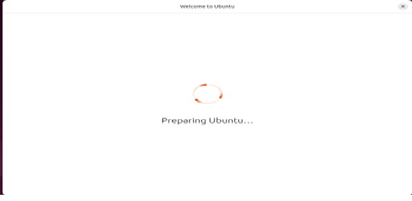
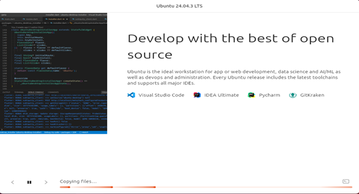

<!--
SPDX-FileCopyrightText: (C) 2026 Intel Corporation
SPDX-License-Identifier: Apache-2.0
-->

# Ubuntu Desktop Raw Image Generation

Generate a custom Ubuntu 24.04/26.04 LTS image with your preferred packages using the automated script and autoinstall configuration.

## Configuration

Update the package list in the `write_files` section of the `auto-install-pkgs.yaml` file:

```yaml
write_files:
  - path: /usr/local/packages.conf
    owner: root:root
    permissions: '0644'
    content: |
      packages:
        - vim
        - curl
        - wget
        - openssh-server
        - net-tools
        - cloud-utils
```

If you have a large `installer.sh`, keep it next to `auto-install-pkgs.yaml` instead of embedding it into YAML. The image preparation script will automatically copy that file into the image as `/usr/local/bin/installer.sh` and execute it during the autoinstall `late-commands` phase.

#### Note

The installer script is updated from:
- Index of `hspe-edge-png-local/ubuntu/milestone/panther-lake/20260512-1624/`

**For any future releases**, please take the latest release above this.

## Usage

Run the script with the ISO URL and configuration file:

```bash
export ISO_URL="https://releases.ubuntu.com/24.04.4/ubuntu-24.04.4-desktop-amd64.iso"
sudo ./prepare-host-img.sh -i "$ISO_URL" -c auto-install-pkgs.yaml

```

On successful execution, the script creates a raw.gz image on same location where the script executed with correctly
labelled partitions as shown below.
- Partition 1 (FAT32): uefi
- Partition 2 (EXT4): rootfs

Cloud-init services are enabled in the raw image (they are disabled by default in desktop images) for zero touch
edge node provisioning.

Finally, the generated image can be hosted on a release service or NGINX server to initiate the provisioning flow

Troubleshooting
---------------

Once the script has started, you can monitor the image generation progress using VNC Viewer.
Please ensure VNC Viewer is installed on your Ubuntu system before proceeding.
Steps to Connect:
1. Open VNC Viewer and enter your development system IP address followed by the port number

Format: <IP_ADDRESS>:<PORT_NUMBER>

Example:
    • Development System IP: 10.20.30.40
    • VNC Port from script: 1
    • VNC Viewer Input: 10.20.30.40:1

This will allow you to view the installation progress in real-time, in general it will take 20 ~30 minutes to complete
the installation.
You will see below screen on the vnc-viewer for successful installation.

## Success Screens

### Success Screen 1


### Success Screen 2


After successful installation the VM will automatically shut down.

Important Note
--------------

If the installation screen remains on screen 1 without progressing to screen 2 after 15-20 minutes
this indicates a potential syntax error or issue in the `auto-install-pkgs.yaml` file.

Action Required
---------------
1. Double-check the `auto-install-pkgs.yaml` file for errors
2. Fix any identified issues
3. Rerun the script


